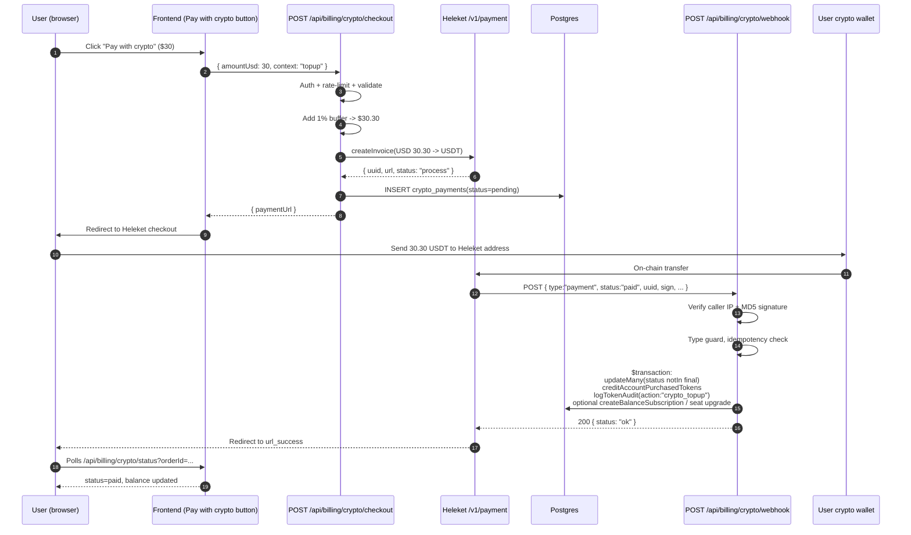

# Heleket — concrete request and response shapes

One gateway, worked end to end. Read this **after**
[`../SKILL.md`](../SKILL.md): the invariants there are what matter, this is what
one provider's wire format looks like when you apply them.

## Contents

- [1. What is Heleket and when to use it](#1-what-is-heleket-and-when-to-use-it)
- [2. Architecture overview](#2-architecture-overview)
- [3. Environment variables](#3-environment-variables)
  - [The test/live boundary — and why it cannot be a sentence](#the-testlive-boundary--and-why-it-cannot-be-a-sentence)
  - [The boot assertion](#the-boot-assertion)
  - [Residual exposure](#residual-exposure)
- [4. Database schema (Prisma)](#4-database-schema-prisma)
- [5. Heleket REST API reference](#5-heleket-rest-api-reference)
- [6. Webhook (IPN) payload reference](#6-webhook-ipn-payload-reference)
- [7. Implementation — client library (`src/lib/heleket.ts`)](#7-implementation--client-library-srclibheleketts)
- [8. Implementation — checkout endpoint](#8-implementation--checkout-endpoint)
- [9. Implementation — webhook endpoint](#9-implementation--webhook-endpoint)
- [10. Status endpoint (for client polling UX)](#10-status-endpoint-for-client-polling-ux)
- [11. The 1% buffer pattern (read this section before adapting)](#11-the-1-buffer-pattern-read-this-section-before-adapting)
- [12. Reconciliation fields (always store)](#12-reconciliation-fields-always-store)
- [13. Refund handling](#13-refund-handling)
- [14. Integration with subscriptions / credits](#14-integration-with-subscriptions--credits)
- [15. Local development & SKIP_BILLING](#15-local-development--skip_billing)
- [16. Testing strategy](#16-testing-strategy)
- [17. Security checklist](#17-security-checklist)
- [18. Common pitfalls & troubleshooting](#18-common-pitfalls--troubleshooting)
- [19. Step-by-step playbook for a NEW project](#19-step-by-step-playbook-for-a-new-project)


> **Provider standing is not a technical property and it changes.** Heleket is
> the successor/parallel service of Cryptomus, which was fined by Canada's
> FINTRAC in October 2025 over anti-money-laundering and terrorist-financing
> compliance (reported by TRM Labs and the International Journalism Foundation,
> checked 2026-08-06). That is a compliance and reputational question for
> whoever routes customer money, and it is not answered by this document.
> Verify the current position of any processor before integrating it, and treat
> the sections below as a worked example of the patterns rather than a
> recommendation.

---

Battle-tested integration playbook based on the Sasai production implementation. Heleket
(`api.heleket.com`) is the modern rebrand of **Cryptomus** — the API surface is identical,
so this guide also applies if you see legacy `cryptomus.com` documentation.

This skill gives the agent everything needed to add crypto payments to a fresh Next.js +
Prisma project end-to-end, or to debug an existing integration.

---

## 1. What is Heleket and when to use it

**Heleket** is a non-custodial crypto payment processor. You create a USD-denominated
invoice via REST API; the user pays in any supported coin/network; Heleket converts at
spot rate and settles to your merchant wallet in your chosen target coin (typically
**USDT**). You receive a webhook (callback) when the payment status changes.

| Property | Value |
|----------|-------|
| API base | `https://api.heleket.com/v1` |
| Default webhook IP | `31.133.220.8` (single static IP) |
| Auth | Per-merchant API key + `merchant` UUID header |
| Signature | MD5 over base64 of JSON body, suffixed with API key |
| **Test credential** | **none.** One key per merchant, which is *also* the webhook signing secret; no sandbox host, no restricted scope, no `test`/`live` marker in the key itself. "Test mode" is a toggle on the merchant account — see [Residual exposure](#residual-exposure) |
| Dashboard | https://heleket.com → Merchant settings |
| Settles to | USDT, USDC, BTC, ETH, BNB, TRX, etc. (configurable per invoice) |
| Pricing currency | Any fiat ISO code (USD recommended) |
| Webhook auth | Signature in body + caller-IP allowlist |

**Use Heleket when** you need a hosted crypto checkout (Heleket renders the QR /
address page) without running your own node, validator, or BTCPay server. **Avoid it**
if you need self-custodied on-chain settlement, support for memo-required coins like
XRP without UI hand-holding, or an audit-grade refund path — refunds in Heleket are
manual and partial.

**Prerequisites**

- Heleket merchant account (KYC for fiat off-ramp, no KYC for crypto-only settlement).
- Public HTTPS callback URL (use ngrok / cloudflared in dev).
- A Postgres database (this guide uses Prisma; SQLite works too, drop the `enum` block).

---

## 2. Architecture overview



The whole lifecycle is **server-driven**. The frontend never holds secrets. The webhook
is the only authoritative source for status changes; client polling is for UX only.

---

## 3. Environment variables

| Variable | Required | Default | Source / Notes |
|----------|----------|---------|----------------|
| `HELEKET_ENV` | yes | **none, deliberately** | `test` \| `production`. The environment this run *declares*. Separate from the key on purpose — one variable that both carries the secret and names its environment cannot be checked against itself. No default: a default is the control disappearing the first time somebody copies a `.env`. |
| `HELEKET_API_KEY` | yes | — | Merchant settings → Payment API. Trim whitespace on read. **Never log this value**, it is also the webhook signing secret. There is no test variant of it — see [Residual exposure](#residual-exposure). |
| `HELEKET_MERCHANT_ID` | yes | — | Merchant settings → Merchant UUID. Sent as `merchant` header on every API call. |
| `HELEKET_LIVE_MERCHANT_ID` | yes | — | The **production** merchant UUID, pinned. Not a secret (it travels in a header on every call); it is the thing that lets a boot assertion tell a live credential from a sandbox one. |
| `HELEKET_LIVE_KEY_FINGERPRINT` | no | — | First 12 hex of `sha256(live key)`. The second discriminator, for when the merchant UUID is shared or unset. A one-way 48-bit prefix over a provider-issued high-entropy secret — see the caveat under [the boot assertion](#the-boot-assertion). |
| `HELEKET_WEBHOOK_IP` | no | `31.133.220.8` | Override only if Heleket changes their callback IP. Localhost (`127.0.0.1` / `::1`) is always allowed for tests. |
| `SKIP_BILLING` | no | `false` | When `true` the checkout endpoint short-circuits, marks the payment paid immediately, and credits the balance — for local dev / staging without hitting Heleket. **Refused when `HELEKET_ENV=production`**: there it is not a shortcut, it is a free-money path. |
| `NEXTAUTH_URL` or `NEXT_PUBLIC_APP_URL` | yes | — | Public origin used to build `url_callback`, `url_success`, `url_return`. Must be HTTPS in production. |

`.env.example` snippet:

```bash
# ── Heleket (crypto payments) ─────────────────────────────────
# Which environment this run declares. No default; the boot assertion refuses an
# unset value rather than guessing, and refuses a credential that disagrees with it.
HELEKET_ENV="test"
# Payment API key and merchant UUID from Heleket merchant settings (https://heleket.com).
# In a test run these MUST be the sandbox merchant's, not production's.
HELEKET_API_KEY=""
HELEKET_MERCHANT_ID=""
# The production merchant, pinned so a test run holding it can be refused at startup.
# Not a secret. Without it, a test run cannot prove it is not live — and is refused.
HELEKET_LIVE_MERCHANT_ID=""
# Optional second discriminator: printf %s "$LIVE_KEY" | shasum -a 256 | cut -c1-12
HELEKET_LIVE_KEY_FINGERPRINT=""
# Whitelist IP for webhook verification (Heleket callback origin).
HELEKET_WEBHOOK_IP="31.133.220.8"
```

**Security**: rotate the API key quarterly, store in a secret manager (Doppler,
AWS Secrets Manager, Cloudflare Workers Secret, K8s Secret), never commit `.env`,
never expose to the client bundle (no `NEXT_PUBLIC_` prefix).

### The test/live boundary — and why it cannot be a sentence

Read the provider's credential model before designing around it, because it is worse
than Stripe's and the difference decides the design:

| | Stripe | Heleket |
|---|---|---|
| Separate test credential | yes, a whole second account | **no** |
| Environment readable from the key | yes, `sk_test_` / `sk_live_` prefix | **no** — an opaque string with no marker |
| Sandbox host | no, same host | no, same host (`api.heleket.com`) |
| What "test mode" is | a property of the key | **a toggle on the merchant account** |
| Key also signs webhooks | no, a separate `whsec_` | **yes, the same value** |

So the house pattern — declare the environment in a variable separate from the secret,
then assert at boot that the two agree (the `stripe-billing` skill, `references/price-integrity.md`,
*Test and live mode*) — applies, but its Stripe implementation does not: there is no key
prefix to read. The comparison has to be made against something else, and Heleket gives
exactly two candidates, both non-secret:

- **the merchant UUID** (`HELEKET_MERCHANT_ID`), which is what distinguishes one merchant
  account from another and travels in a header on every call;
- **a fingerprint of the key**, for when the UUID is shared or absent.

Pin the production values and the assertion below can refuse a mismatch in **both**
directions. One direction is half a boundary: a production key in a dev run is the
obvious loss, and a sandbox key in production is the quiet one — invoices created
against a merchant nobody reconciles, money settling to the wrong wallet, and no error
until somebody asks where the week's revenue went.

**Strongest control first.** The assertion is the *second* line. The first is a
**separate sandbox merchant account**, so the credential a dev machine holds authorises
nothing on the live merchant — M-06's point exactly: a credential that cannot reach
production beats a sentence saying not to use it there, because it still works after
everyone has forgotten the sentence. Check whether your Heleket account permits a second
merchant before assuming it does; this document cannot confirm it for you, and if it does
not, the exposure below is what you are left holding.

### The boot assertion

Fails at **startup**, not at the first charge. Copy it whole:

```ts
// src/lib/heleket-env.ts
import { createHash } from "node:crypto";

export type HeleketEnv = "test" | "production";

/** Codes, not sentences. A code survives a rewording, greps out of a log, and is what
 *  an alert should fire on. */
export type HeleketEnvErrorCode =
  | "HELEKET_ENV_MISSING"
  | "HELEKET_ENV_INVALID"
  | "HELEKET_ENV_UNPINNED"
  | "HELEKET_ENV_TEST_HOLDS_LIVE_CREDENTIAL"
  | "HELEKET_ENV_LIVE_HOLDS_TEST_CREDENTIAL"
  | "HELEKET_ENV_LIVE_WITH_SKIP_BILLING";

export class HeleketEnvError extends Error {
  constructor(readonly code: HeleketEnvErrorCode, message: string) {
    super(`${code}: ${message}`);
    this.name = "HeleketEnvError";
  }
}

/**
 * 48-bit prefix of SHA-256 over the key.
 *
 * Safe to keep in configuration ONLY because a Heleket API key is a long
 * provider-issued random string: the digest is one-way and 12 hex characters carry
 * nothing recoverable. Never fingerprint a value a human chose — for a guessable
 * secret this publishes a confirmation oracle. If in doubt, pin the merchant UUID
 * instead and leave this unset.
 */
export function keyFingerprint(key: string): string {
  return createHash("sha256").update(key.trim()).digest("hex").slice(0, 12);
}

type Identity = "live" | "not-live" | "unknown";

/** Which credential is this, judged only against pinned non-secret values. */
function identify(env: NodeJS.ProcessEnv): Identity {
  const key = env.HELEKET_API_KEY?.trim();
  const merchant = env.HELEKET_MERCHANT_ID?.trim();
  const liveMerchant = env.HELEKET_LIVE_MERCHANT_ID?.trim();
  const liveFinger = env.HELEKET_LIVE_KEY_FINGERPRINT?.trim().toLowerCase();

  if (!liveMerchant && !liveFinger) return "unknown";
  if (liveMerchant && merchant && merchant === liveMerchant) return "live";
  if (liveFinger && key && keyFingerprint(key) === liveFinger) return "live";
  if ((liveMerchant && merchant) || (liveFinger && key)) return "not-live";
  return "unknown";
}

export function assertHeleketEnv(env: NodeJS.ProcessEnv = process.env): HeleketEnv {
  const declared = env.HELEKET_ENV?.trim();

  if (!declared) {
    throw new HeleketEnvError(
      "HELEKET_ENV_MISSING",
      "HELEKET_ENV is unset. It has no default on purpose: a default is the control " +
        'disappearing the first time somebody copies a .env. Set "test" or "production".',
    );
  }
  if (declared !== "test" && declared !== "production") {
    throw new HeleketEnvError(
      "HELEKET_ENV_INVALID",
      `HELEKET_ENV="${declared}" — expected "test" or "production".`,
    );
  }

  if (declared === "production" && env.SKIP_BILLING === "true") {
    throw new HeleketEnvError(
      "HELEKET_ENV_LIVE_WITH_SKIP_BILLING",
      "SKIP_BILLING=true credits balances with no payment behind them. In production " +
        "that is not a shortcut, it is a free-money path reachable by anyone who can " +
        "read the checkout URL.",
    );
  }

  const identity = identify(env);

  // Direction 1 — a live credential declared test. The dev machine, the CI job and the
  // agent run all hold a key that creates real invoices the moment the dashboard
  // toggle moves.
  if (declared === "test" && identity === "live") {
    throw new HeleketEnvError(
      "HELEKET_ENV_TEST_HOLDS_LIVE_CREDENTIAL",
      "HELEKET_ENV=test but this is the pinned production credential. Heleket has no " +
        "test key: the same value that signs your webhooks creates real invoices as " +
        "soon as merchant Test mode is off. Use the sandbox merchant account.",
    );
  }

  // Cannot tell is refused, not assumed — on the test side, which is where the control
  // has to hold. "We could not prove it was safe" must never read as "it was safe".
  if (declared === "test" && identity === "unknown") {
    throw new HeleketEnvError(
      "HELEKET_ENV_UNPINNED",
      "HELEKET_ENV=test but neither HELEKET_LIVE_MERCHANT_ID nor " +
        "HELEKET_LIVE_KEY_FINGERPRINT is pinned, so nothing here can prove this " +
        "credential is not the production one.",
    );
  }

  // Direction 2 — a test credential declared live. The quiet one: invoices settle to a
  // merchant nobody reconciles and no error surfaces until revenue is missing.
  if (declared === "production" && identity === "not-live") {
    throw new HeleketEnvError(
      "HELEKET_ENV_LIVE_HOLDS_TEST_CREDENTIAL",
      "HELEKET_ENV=production but this credential is not the pinned live merchant's. " +
        "Invoices would be created against the wrong merchant and settle to a wallet " +
        "your reconciliation never reads.",
    );
  }

  if (declared === "production" && identity === "unknown") {
    console.warn(
      "[heleket] HELEKET_ENV=production with no live pin. Set HELEKET_LIVE_MERCHANT_ID " +
        "— it is what lets a test run be refused.",
    );
  }

  return declared;
}
```

Wire it at module load of the client library, above every export, so the process cannot
reach a request handler in a state the assertion would have rejected:

```ts
// src/lib/heleket.ts — first executable line
import { assertHeleketEnv } from "./heleket-env";

export const HELEKET_ENV = assertHeleketEnv();
```

Calling it from the checkout handler instead is a control that only fires once a user is
already trying to pay, and never at all in the run that merely holds the key.

### Residual exposure

**Named because it does not go away, and an unwritten risk reads as an absent one.**

Heleket issues **one credential per merchant** and it is also the webhook signing secret.
There is no test key, no sandbox host and no read-only scope. "Test mode" is a toggle in
merchant settings (Section 15), which means the *same* key creates $1 test invoices before
the toggle moves and real ones after it — and it moves in a dashboard, by anyone with
dashboard access, with no deploy and no signal to the machines holding that key.

Three consequences, stated rather than implied:

1. **Unless you hold a second merchant account, a developer following Section 15 Option B
   holds a production credential.** The assertion above narrows that window — it refuses
   the run that declares the wrong environment — but it cannot make the key harmless. It
   is a check on the declaration, not a limit on the credential.
2. **The key cannot be scoped down.** Because it doubles as the signing secret, you cannot
   issue a verify-only credential for a service that merely validates callbacks; every
   holder of the verifier can also create invoices.
3. **Rotation is the only real revocation.** There is no per-environment key to revoke, so
   a leak from a dev machine is a production incident: rotate in merchant settings, and
   re-pin `HELEKET_LIVE_KEY_FINGERPRINT` in the same change or the assertion starts
   answering about a key that no longer exists.

If the compliance posture in the banner at the top of this document matters to you, this
credential model is part of the same assessment.

---

## 4. Database schema (Prisma)

Drop these blocks into `prisma/schema.prisma` and run `npx prisma migrate dev --name
add_crypto_payments`.

```prisma
enum CryptoPaymentStatus {
  pending          // process, check
  confirming       // confirm_check
  paid             // paid
  paid_over        // paid_over (overpayment)
  wrong_amount     // wrong_amount, wrong_amount_waiting (partial)
  cancelled        // cancel
  failed           // fail, system_fail, refund_fail
  refund_process   // refund_process
  refund_paid      // refund_paid
  locked           // AML hold
}

model CryptoPayment {
  id               String              @id @default(cuid())
  userId           String              @map("user_id")
  heleketuuid      String              @unique @map("heleket_uuid")
  orderId          String              @unique @map("order_id")
  amountUsd        Float               @map("amount_usd")          // base amount user requested
  tokenAmount      Float               @map("token_amount")        // base + buffer = amount sent to Heleket
  status           CryptoPaymentStatus @default(pending)
  paymentUrl       String?             @map("payment_url")
  currency         String?                                          // pricing currency, "USD"
  network          String?                                          // settlement network reported by Heleket
  payerCurrency    String?             @map("payer_currency")       // coin the user actually paid in
  paymentAmountUsd Float?              @map("payment_amount_usd")   // USD value Heleket received
  merchantAmount   String?             @map("merchant_amount")      // amount credited to merchant wallet
  fromAddress      String?             @map("from_address")         // payer wallet address
  commissionAmount String?             @map("commission_amount")    // Heleket fee
  txid             String?                                          // on-chain tx hash
  metadata         Json?                                            // arbitrary context (planProductId, seatUpgrade, etc.)
  createdAt        DateTime            @default(now()) @map("created_at")
  updatedAt        DateTime            @updatedAt @map("updated_at")

  user          User           @relation(fields: [userId], references: [id], onDelete: Cascade)
  // Optional: link to subscriptions funded by this payment
  // subscriptions Subscription[]

  @@index([userId, createdAt])
  @@map("crypto_payments")
}
```

Optional **funding-source linkage** on your `Subscription` model (drop if you do not have
balance-funded subs):

```prisma
model Subscription {
  // ...
  paymentSource    String?  @map("payment_source")    // "stripe" | "balance"
  fundingSource    String?  @map("funding_source")    // "topup" | "crypto" | null
  cryptoPaymentId  String?  @map("crypto_payment_id")
  cryptoPayment    CryptoPayment? @relation(fields: [cryptoPaymentId], references: [id])
}
```

The composite index `@@index([userId, createdAt])` is critical — it powers the user-facing
billing history page.

---

## 5. Heleket REST API reference

All API calls are `POST` with JSON body, two custom headers, and a unified envelope.

| Header | Value |
|--------|-------|
| `merchant` | `HELEKET_MERCHANT_ID` (raw UUID string) |
| `sign` | `MD5(base64(JSON.stringify(body)) + apiKey)` |
| `Content-Type` | `application/json` |

Success envelope:

```json
{ "state": 0, "result": { ... } }
```

Error envelope:

```json
{ "state": 1, "message": "Reason..." }
```

Treat `state !== 0` as an error and surface `message` (or stringified `errors`) to the
caller.

### POST `/v1/payment` — create invoice

Request fields (only the ones you need; snake_case in the body):

| Field | Type | Notes |
|-------|------|-------|
| `amount` | string | Decimal, **2 dp** for USD (`"30.30"`). |
| `currency` | string | Pricing currency, ISO code (`"USD"`). |
| `order_id` | string | Your idempotency key, must be globally unique per merchant. |
| `network` | string? | Force a specific network (e.g. `"tron"`, `"ethereum"`). Omit to let user pick. |
| `to_currency` | string? | Settlement coin (`"USDT"`, `"USDC"`, etc.). |
| `url_callback` | string? | Public HTTPS endpoint for IPN. |
| `url_success` | string? | Where Heleket redirects after the user pays. |
| `url_return` | string? | Where Heleket redirects on cancel/back. |
| `is_payment_multiple` | bool? | `false` to disable multiple payments to the same address. |
| `lifetime` | int? | Seconds before invoice expires. Use `3600` (1h). |
| `additional_data` | string? | Arbitrary string, **≤ 255 chars**, echoed in the webhook. Use it to carry your own metadata JSON (truncate if needed). |
| `subtract` | int? | Take fees from payer (`0`) or merchant (`100`). |
| `accuracy_payment_percent` | number? | Tolerance for under/overpayment. |

Response (`result`) — useful fields:

```jsonc
{
  "uuid": "abc123-...",                  // Heleket internal ID
  "order_id": "crypto_xyz_...",          // echo of your order_id
  "url": "https://heleket.com/pay/...",  // hosted checkout URL — redirect user here
  "amount": "30.30",
  "currency": "USD",
  "payment_amount": null,
  "payment_amount_usd": "0",
  "payer_amount": "30.30",
  "payer_currency": "USDT",
  "merchant_amount": "0",
  "network": "tron",
  "address": "TXyz...",                  // settlement address
  "from": null,
  "txid": null,
  "payment_status": "process",
  "expired_at": 1737000000,
  "status": "process",
  "is_final": false,
  "additional_data": "{\"context\":\"topup\"}",
  "created_at": "...",
  "updated_at": "...",
  "commission": "0.30",
  "address_qr_code": "data:image/png;base64,..."
}
```

### POST `/v1/payment/info` — refresh status

Body: `{ "uuid": "..." }` **or** `{ "order_id": "..." }`. Response shape identical to
create. Use this for manual reconciliation (e.g. user asks "where's my payment", or a
cron sweep over `pending` rows older than the invoice lifetime).

### POST `/v1/payment/services` — list networks/coins

Body: `{}`. Returns an array of `{ network, currency, is_available, is_enabled, limit:
{ min_amount, max_amount }, commission: { fee_amount, percent } }` so you can render a
selector or block coins below their min.

### MD5 signing — worked example

```ts
import { createHash } from "crypto";

const body = { amount: "30.30", currency: "USD", order_id: "crypto_abc" };
const apiKey = "your-api-key";

const json = JSON.stringify(body);                                 // {"amount":"30.30","currency":"USD","order_id":"crypto_abc"}
const base64 = Buffer.from(json).toString("base64");               // eyJhbW91bnQiOi...
const sign = createHash("md5").update(base64 + apiKey).digest("hex");
// → 32-char lowercase hex
```

**Critical**: sign the **exact bytes you send over the wire**. If you serialize the body
once for signing and again for `fetch`, you risk a key-order or whitespace mismatch.

---

## 6. Webhook (IPN) payload reference

Heleket POSTs JSON to `url_callback` whenever a payment changes status.

| Field | Type | Notes |
|-------|------|-------|
| `type` | string | Always `"payment"` for invoice events. Other values exist for other product lines — **filter on `type === "payment"`**. |
| `uuid` | string | Heleket invoice ID. |
| `order_id` | string | Your `order_id`. Use as the primary lookup key. |
| `status` | string | One of the 14 lifecycle values below. |
| `payment_amount_usd` | string | USD value of what Heleket actually received. **Use this as the credit amount when present.** |
| `payer_amount` | string | Amount in payer's coin. |
| `payer_currency` | string | Coin the user paid in (`"USDT"`). |
| `network` | string | Network used (`"tron"`). |
| `merchant_amount` | string | What landed in the merchant wallet (after Heleket fee). |
| `from` | string | Payer wallet address. **Store for AML / refund.** |
| `commission` | string | Heleket's fee. |
| `txid` | string | On-chain tx hash. |
| `additional_data` | string? | Echo of your invoice's `additional_data`. |
| `sign` | string | MD5 of the body **excluding `sign`**. |

### The 14 statuses

| Heleket status | Meaning | Internal enum |
|----------------|---------|---------------|
| `process` | Invoice created, awaiting payment | `pending` |
| `check` | Payment seen in mempool, not yet confirmed | `pending` |
| `confirm_check` | Confirming on blockchain | `confirming` |
| `paid` | Fully paid and confirmed | `paid` ← **CREDIT** |
| `paid_over` | Overpayment confirmed | `paid_over` ← **CREDIT** |
| `wrong_amount` | Underpayment, accepted as-is | `wrong_amount` |
| `wrong_amount_waiting` | Underpayment, waiting for top-up | `wrong_amount` |
| `cancel` | Payer cancelled | `cancelled` |
| `fail` | Payment failed | `failed` |
| `system_fail` | Heleket internal error | `failed` |
| `refund_process` | Merchant-initiated refund pending | `refund_process` |
| `refund_paid` | Refund completed | `refund_paid` |
| `refund_fail` | Refund failed | `failed` |
| `locked` | AML hold (compliance review) | `locked` |

**Final statuses** (do not transition further): `paid`, `paid_over`, `cancel`, `fail`,
`system_fail`, `refund_paid`, `locked`.

---

## 7. Implementation — client library (`src/lib/heleket.ts`)

Drop this verbatim into your project. Zero dependencies beyond the Node `crypto` module
and your logger.

```ts
import { createHash, timingSafeEqual } from "crypto";
import { logger } from "@/lib/logger";

const HELEKET_API_BASE = "https://api.heleket.com/v1";

function getApiKey(): string {
  const key = process.env.HELEKET_API_KEY?.trim();
  if (!key) throw new Error("HELEKET_API_KEY is not set");
  return key;
}

function getMerchantId(): string {
  const id = process.env.HELEKET_MERCHANT_ID?.trim();
  if (!id) throw new Error("HELEKET_MERCHANT_ID is not set");
  return id;
}

/**
 * MD5 sign for outgoing API requests.
 * Algorithm: MD5(base64(JSON.stringify(body)) + apiKey).
 * Signs the EXACT bytes we send over the wire.
 */
export function computeSign(body: Record<string, unknown>, apiKey: string): string {
  const jsonStr = JSON.stringify(body);
  const base64 = Buffer.from(jsonStr).toString("base64");
  return createHash("md5").update(base64 + apiKey).digest("hex");
}

/**
 * MD5 sign with PHP-style slash escaping (/ → \/).
 * PHP's json_encode() escapes forward slashes by default, so Heleket's PHP backend
 * signs the webhook body using this escaped form. We must verify against BOTH variants.
 */
export function computeSignPhp(body: Record<string, unknown>, apiKey: string): string {
  const jsonStr = JSON.stringify(body).replace(/\//g, "\\/");
  const base64 = Buffer.from(jsonStr).toString("base64");
  return createHash("md5").update(base64 + apiKey).digest("hex");
}

/**
 * Verify webhook signature. Strip the `sign` field before passing the body in.
 * Tries PHP-escaped first (Heleket's actual format), then plain — defends against
 * future server changes. Uses timingSafeEqual to prevent timing attacks.
 */
export function verifyWebhookSignature(
  bodyWithoutSign: Record<string, unknown>,
  receivedSign: string,
  apiKey: string,
): boolean {
  if (receivedSign.length !== 32) return false;

  const phpSign = computeSignPhp(bodyWithoutSign, apiKey);
  if (timingSafeEqual(Buffer.from(phpSign), Buffer.from(receivedSign))) return true;

  const plainSign = computeSign(bodyWithoutSign, apiKey);
  if (timingSafeEqual(Buffer.from(plainSign), Buffer.from(receivedSign))) return true;

  return false;
}

async function heleletRequest<T>(
  endpoint: string,
  body: Record<string, unknown>,
): Promise<T> {
  const apiKey = getApiKey();
  const merchantId = getMerchantId();
  const sign = computeSign(body, apiKey);

  const url = `${HELEKET_API_BASE}${endpoint}`;
  logger.debug("Heleket API request", { url, body });

  const response = await fetch(url, {
    method: "POST",
    headers: {
      merchant: merchantId,
      sign,
      "Content-Type": "application/json",
    },
    body: JSON.stringify(body),
  });

  const data = await response.json();

  if (data.state !== 0) {
    const errMsg = data.message || data.errors || "Unknown Heleket error";
    logger.error("Heleket API error", { url, state: data.state, error: errMsg });
    throw new Error(typeof errMsg === "string" ? errMsg : JSON.stringify(errMsg));
  }

  return data.result as T;
}

// ── Create Invoice ────────────────────────────────────────────────────────

export interface CreateInvoiceParams {
  amount: string;            // 2-dp decimal string
  currency: string;          // pricing currency, e.g. "USD"
  orderId: string;           // your idempotency key
  network?: string;
  toCurrency?: string;       // settlement coin, e.g. "USDT"
  urlCallback?: string;
  urlSuccess?: string;
  urlReturn?: string;
  isPaymentMultiple?: boolean;
  lifetime?: number;
  additionalData?: string;   // ≤ 255 chars
  subtract?: number;
  accuracyPaymentPercent?: number;
}

export interface InvoiceResult {
  uuid: string;
  order_id: string;
  amount: string;
  payment_amount: string | null;
  payment_amount_usd: string;
  payer_amount: string;
  payer_currency: string;
  currency: string;
  merchant_amount: string;
  network: string;
  address: string | null;
  from: string | null;
  txid: string | null;
  payment_status: string;
  url: string;
  expired_at: number;
  status: string;
  is_final: boolean;
  additional_data: string | null;
  created_at: string;
  updated_at: string;
  commission: string;
  address_qr_code?: string;
}

export async function createInvoice(params: CreateInvoiceParams): Promise<InvoiceResult> {
  const body: Record<string, unknown> = {
    amount: params.amount,
    currency: params.currency,
    order_id: params.orderId,
  };
  if (params.network) body.network = params.network;
  if (params.toCurrency) body.to_currency = params.toCurrency;
  if (params.urlCallback) body.url_callback = params.urlCallback;
  if (params.urlSuccess) body.url_success = params.urlSuccess;
  if (params.urlReturn) body.url_return = params.urlReturn;
  if (params.isPaymentMultiple !== undefined) body.is_payment_multiple = params.isPaymentMultiple;
  if (params.lifetime) body.lifetime = params.lifetime;
  if (params.additionalData) body.additional_data = params.additionalData;
  if (params.subtract !== undefined) body.subtract = params.subtract;
  if (params.accuracyPaymentPercent !== undefined) {
    body.accuracy_payment_percent = params.accuracyPaymentPercent;
  }
  return heleletRequest<InvoiceResult>("/payment", body);
}

// ── Payment Info ──────────────────────────────────────────────────────────

export async function getPaymentInfo(
  identifier: { uuid: string } | { orderId: string },
): Promise<InvoiceResult> {
  const body: Record<string, unknown> = {};
  if ("uuid" in identifier) body.uuid = identifier.uuid;
  else body.order_id = identifier.orderId;
  return heleletRequest<InvoiceResult>("/payment/info", body);
}

// ── Webhook IP Allowlist ──────────────────────────────────────────────────

const DEFAULT_WEBHOOK_IP = "31.133.220.8";

export function isAllowedWebhookIp(ip: string): boolean {
  const allowed = process.env.HELEKET_WEBHOOK_IP || DEFAULT_WEBHOOK_IP;
  return ip === allowed || ip === "127.0.0.1" || ip === "::1";
}

// ── Status Helpers ────────────────────────────────────────────────────────

export type HeleletWebhookStatus =
  | "process" | "check" | "confirm_check"
  | "paid" | "paid_over"
  | "wrong_amount" | "wrong_amount_waiting"
  | "cancel" | "fail" | "system_fail"
  | "refund_process" | "refund_fail" | "refund_paid"
  | "locked";

export function isFinalStatus(status: string): boolean {
  return ["paid", "paid_over", "cancel", "fail", "system_fail", "refund_paid", "locked"]
    .includes(status);
}

export function isPaidStatus(status: string): boolean {
  return status === "paid" || status === "paid_over";
}
```

### The PHP-escape gotcha (read this twice)

Heleket's backend is PHP. PHP's `json_encode()` escapes forward slashes (`/` → `\/`) by
default, and that escaped form is what gets MD5-signed. Node's `JSON.stringify` does not.

If you only verify against the plain form, **every webhook containing a URL or path will
fail signature verification** (e.g. `url_callback`, `from` address never has slashes but
your `additional_data` JSON might). Always try `computeSignPhp` first, then fall back to
`computeSign`. The dual verifier above is mandatory.

---

## 8. Implementation — checkout endpoint

Authenticated, rate-limited, validates input, applies the 1% buffer, creates the Heleket
invoice, persists the row, returns the redirect URL.

```ts
// src/app/api/billing/crypto/checkout/route.ts
import { NextResponse } from "next/server";
import { auth } from "@/lib/auth";
import { db } from "@/lib/db";
import { createInvoice } from "@/lib/heleket";
import { creditAccountPurchasedTokens } from "@/lib/account-balance";
import { logTokenAudit } from "@/lib/token-audit";
import { randomUUID } from "crypto";
import { logger } from "@/lib/logger";
import { rateLimit } from "@/lib/rate-limit";

export const dynamic = "force-dynamic";

const SKIP_BILLING = process.env.SKIP_BILLING === "true";
const MIN_AMOUNT = 10;
const MAX_AMOUNT = 10000;
const CRYPTO_BUFFER_RATE = 0.01;          // 1% buffer for slippage
const INVOICE_LIFETIME_SECONDS = 3600;    // 1 hour

export async function POST(request: Request) {
  // 1. Auth
  const session = await auth();
  if (!session?.user?.id) {
    return NextResponse.json({ error: "Unauthorized" }, { status: 401 });
  }
  const userId = session.user.id;

  // 2. Rate limit (5/min, 12/hour) — prevents invoice spam
  if (!rateLimit(`crypto-checkout:${userId}`, 5, 60_000).allowed) {
    return NextResponse.json({ error: "Too many requests" }, { status: 429 });
  }
  if (!rateLimit(`crypto-checkout-hour:${userId}`, 12, 3_600_000).allowed) {
    return NextResponse.json(
      { error: "Too many crypto invoices created. Wait up to an hour or finish an open one." },
      { status: 429 },
    );
  }

  // 3. Parse + validate body
  let body: Record<string, unknown>;
  try {
    body = await request.json();
  } catch {
    return NextResponse.json({ error: "Invalid JSON body" }, { status: 400 });
  }

  const {
    amountUsd,
    context = "topup",                // "topup" | "subscription" | "seat_upgrade"
    successUrl: customSuccessUrl,
    cancelUrl: customCancelUrl,
    ...extra                          // planProductId, subscriptionId, targetQuantity, etc.
  } = body as { amountUsd?: number; context?: string; successUrl?: string; cancelUrl?: string };

  if (!amountUsd || typeof amountUsd !== "number" ||
      amountUsd < MIN_AMOUNT || amountUsd > MAX_AMOUNT) {
    return NextResponse.json(
      { error: `Amount must be between $${MIN_AMOUNT} and $${MAX_AMOUNT}` },
      { status: 400 },
    );
  }

  // 4. Compute amounts (1% buffer for crypto slippage)
  const orderId = `crypto_${userId.slice(0, 8)}_${Date.now()}_${randomUUID().slice(0, 8)}`;
  const bufferAmount = Math.ceil(amountUsd * CRYPTO_BUFFER_RATE * 100) / 100;
  const invoiceAmount = Math.round((amountUsd + bufferAmount) * 100) / 100;
  const tokenAmount = invoiceAmount;     // user gets the buffer back as balance

  // 5. Build callback / success / return URLs (same-origin only)
  const appUrl = process.env.NEXTAUTH_URL || process.env.NEXT_PUBLIC_APP_URL || "";
  const isSameOrigin = (url?: string) => {
    if (!url || !appUrl) return false;
    try { return new URL(url).origin === new URL(appUrl).origin; } catch { return false; }
  };
  const successUrl = isSameOrigin(customSuccessUrl)
    ? `${customSuccessUrl}${customSuccessUrl!.includes("?") ? "&" : "?"}crypto_success=true&orderId=${orderId}`
    : `${appUrl}/billing?crypto_success=true&orderId=${orderId}`;
  const returnUrl = isSameOrigin(customCancelUrl) ? customCancelUrl! : `${appUrl}/billing`;
  const callbackUrl = `${appUrl}/api/billing/crypto/webhook`;

  // 6. Build metadata (echoed back via additional_data, max 255 chars)
  const metadata = { userId, context, ...extra,
    bufferRate: CRYPTO_BUFFER_RATE, bufferAmount,
    baseAmountUsd: amountUsd, invoiceAmountUsd: invoiceAmount };
  const additionalDataStr = JSON.stringify(metadata);
  const additionalData = additionalDataStr.length <= 255 ? additionalDataStr : undefined;

  // 7. SKIP_BILLING — local dev / staging short-circuit
  if (SKIP_BILLING) {
    const mockUuid = `mock_${randomUUID()}`;
    const record = await db.$transaction(async (tx) => {
      const created = await tx.cryptoPayment.create({
        data: {
          userId, heleketuuid: mockUuid, orderId,
          amountUsd, tokenAmount,
          status: "paid", paymentUrl: successUrl,
          paymentAmountUsd: invoiceAmount, currency: "USD",
          metadata: metadata as any,
        },
      });
      const balanceResult = await creditAccountPurchasedTokens(tx, userId, invoiceAmount);
      await logTokenAudit({
        userId, action: "crypto_topup", amount: invoiceAmount, source: "heleket_mock",
        balanceBefore: { /* fetch before */ }, balanceAfter: { /* result */ },
        metadata: { orderId, mock: true, bufferAmount }, tx,
      });
      return created;
    });
    return NextResponse.json({ paymentUrl: successUrl, orderId: record.orderId,
      heleketuuid: record.heleketuuid, mock: true });
  }

  // 8. Real Heleket call
  let invoice;
  try {
    invoice = await createInvoice({
      amount: invoiceAmount.toFixed(2),
      currency: "USD",
      orderId,
      toCurrency: "USDT",
      urlCallback: callbackUrl,
      urlSuccess: successUrl,
      urlReturn: returnUrl,
      isPaymentMultiple: false,
      lifetime: INVOICE_LIFETIME_SECONDS,
      additionalData,
    });
  } catch (err) {
    logger.error("Failed to create crypto invoice", {
      error: err instanceof Error ? err.message : String(err), userId, amountUsd });
    return NextResponse.json({ error: "Failed to create payment. Please try again." },
      { status: 500 });
  }

  // 9. Persist DB row. If this fails we have an orphan invoice at Heleket — log it loudly.
  try {
    await db.cryptoPayment.create({
      data: {
        userId,
        heleketuuid: invoice.uuid,
        orderId,
        amountUsd,
        tokenAmount,
        status: "pending",
        paymentUrl: invoice.url,
        currency: invoice.currency,
        network: invoice.network || null,
        metadata: metadata as any,
      },
    });
  } catch (dbErr) {
    logger.error("ORPHAN INVOICE — Heleket invoice created but DB insert failed", {
      error: dbErr instanceof Error ? dbErr.message : String(dbErr),
      userId, orderId, heleketuuid: invoice.uuid,
    });
    return NextResponse.json({ error: "Failed to create payment. Please try again." },
      { status: 500 });
  }

  return NextResponse.json({ paymentUrl: invoice.url, orderId, heleketuuid: invoice.uuid });
}
```

**Key invariants the agent must preserve when adapting:**

- `orderId` is **globally unique** and **prefixed** so it is recognizable in logs.
- `additional_data` is **truncated to 255 chars or omitted** — Heleket silently drops
  oversized values, and you cannot rely on them in the webhook.
- Custom redirect URLs are **same-origin-validated** to prevent open-redirect abuse.
- `lifetime: 3600` is a sensible default — long enough for slow networks, short enough
  to free up the slot quickly.
- The orphan-invoice path **MUST log loudly** (Sentry, Telegram alert) — those are
  reconcilable manually via `getPaymentInfo`.

---

## 9. Implementation — webhook endpoint

The webhook is the single source of truth for status changes. It must be:

1. **CSRF-exempt** (no browser is the caller).
2. **IP-allowlisted** (proxy-aware).
3. **Signature-verified** (constant-time).
4. **Type-filtered** (`type === "payment"`).
5. **Idempotent** (replay-safe via conditional `updateMany`).
6. **Transactional** (status update + credit + audit log = one DB transaction).

```ts
// src/app/api/billing/crypto/webhook/route.ts
import { NextResponse } from "next/server";
import { db } from "@/lib/db";
import { verifyWebhookSignature, isAllowedWebhookIp, isPaidStatus } from "@/lib/heleket";
import { creditAccountPurchasedTokens } from "@/lib/account-balance";
import { logTokenAudit } from "@/lib/token-audit";
import { notify } from "@/lib/notifications";
import { logger } from "@/lib/logger";
import type { CryptoPaymentStatus } from "@prisma/client";

export const dynamic = "force-dynamic";

function mapHeleletStatus(status: string): CryptoPaymentStatus {
  switch (status) {
    case "process": case "check":               return "pending";
    case "confirm_check":                       return "confirming";
    case "paid":                                return "paid";
    case "paid_over":                           return "paid_over";
    case "wrong_amount": case "wrong_amount_waiting": return "wrong_amount";
    case "cancel":                              return "cancelled";
    case "fail": case "system_fail": case "refund_fail": return "failed";
    case "refund_process":                      return "refund_process";
    case "refund_paid":                         return "refund_paid";
    case "locked":                              return "locked";
    default:                                    return "pending";
  }
}

// Proxy-aware IP extraction. Order matters: trust DO/Cloudflare/your CDN headers
// before falling back to the LAST hop of x-forwarded-for (the closest hop = your edge).
function extractIp(request: Request): string {
  const doConnecting = request.headers.get("do-connecting-ip");        // DigitalOcean
  if (doConnecting) return doConnecting.trim();
  const cf = request.headers.get("cf-connecting-ip");                  // Cloudflare
  if (cf) return cf.trim();
  const forwarded = request.headers.get("x-forwarded-for");
  if (forwarded) {
    const parts = forwarded.split(",").map((s) => s.trim()).filter(Boolean);
    return parts[parts.length - 1];                                    // last = closest to us
  }
  return request.headers.get("x-real-ip") || "unknown";
}

export async function POST(request: Request) {
  // 1. IP allowlist
  const ip = extractIp(request);
  if (!isAllowedWebhookIp(ip)) {
    logger.warn("Heleket webhook rejected: IP not allowed", { ip });
    return NextResponse.json({ error: "Forbidden" }, { status: 403 });
  }

  // 2. Parse body
  let rawBody: Record<string, unknown>;
  try { rawBody = await request.json(); }
  catch { return NextResponse.json({ error: "Invalid body" }, { status: 400 }); }

  const { sign, ...bodyWithoutSign } = rawBody as Record<string, unknown> & { sign?: string };
  if (!sign) return NextResponse.json({ error: "Missing signature" }, { status: 400 });

  // 3. Signature
  const apiKey = process.env.HELEKET_API_KEY?.trim();
  if (!apiKey) return NextResponse.json({ error: "Webhook not configured" }, { status: 500 });
  if (!verifyWebhookSignature(bodyWithoutSign, sign, apiKey)) {
    logger.warn("Heleket webhook rejected: invalid signature", { ip });
    return NextResponse.json({ error: "Invalid signature" }, { status: 400 });
  }

  // 4. Type filter — only invoice events
  const webhookType = bodyWithoutSign.type as string | undefined;
  if (webhookType && webhookType !== "payment") {
    return NextResponse.json({ status: "ok" });
  }

  // 5. Extract fields
  const orderId      = bodyWithoutSign.order_id as string | undefined;
  const heleketuuid  = bodyWithoutSign.uuid as string | undefined;
  const webhookStatus = bodyWithoutSign.status as string;
  const rawAmt        = bodyWithoutSign.payment_amount_usd ? parseFloat(bodyWithoutSign.payment_amount_usd as string) : null;
  const paymentAmountUsd = rawAmt !== null && Number.isFinite(rawAmt) ? rawAmt : null;
  const txid           = bodyWithoutSign.txid as string | undefined;
  const payerCurrency  = bodyWithoutSign.payer_currency as string | undefined;
  const network        = bodyWithoutSign.network as string | undefined;
  const merchantAmount = bodyWithoutSign.merchant_amount as string | undefined;
  const fromAddress    = bodyWithoutSign.from as string | undefined;
  const commissionAmount = bodyWithoutSign.commission as string | undefined;

  if (!orderId && !heleketuuid) {
    return NextResponse.json({ error: "Missing order_id or uuid" }, { status: 400 });
  }

  const payment = await db.cryptoPayment.findFirst({
    where: orderId ? { orderId } : { heleketuuid: heleketuuid! },
  });
  if (!payment) {
    logger.error("Heleket webhook: payment row not found", { orderId, heleketuuid });
    // Return 200 to stop Heleket retrying a permanently unknown payment.
    return NextResponse.json({ status: "ok" });
  }

  const FINAL: CryptoPaymentStatus[] = ["paid", "paid_over"];
  if (FINAL.includes(payment.status)) {
    return NextResponse.json({ status: "ok" });    // already credited, ignore
  }

  const mappedStatus = mapHeleletStatus(webhookStatus);
  const meta = { paymentAmountUsd: paymentAmountUsd ?? undefined, txid, payerCurrency,
    network, merchantAmount, fromAddress, commissionAmount };

  if (isPaidStatus(webhookStatus)) {
    // Credit waterfall: trust Heleket's USD figure first, then our buffered total,
    // finally the user's base amount as a last resort.
    const creditAmount = paymentAmountUsd ?? payment.tokenAmount ?? payment.amountUsd;

    const claimed = await db.$transaction(async (tx) => {
      // Idempotency — only the first paid webhook flips the status.
      const updated = await tx.cryptoPayment.updateMany({
        where: { id: payment.id, status: { notIn: FINAL } },
        data:  { status: mappedStatus, ...meta },
      });
      if (updated.count === 0) return false;       // someone else got here first

      const user = await tx.user.findUniqueOrThrow({
        where: { id: payment.userId },
        select: { accountSubscriptionTokens: true, accountPurchasedTokens: true },
      });
      const balanceBefore = { ...user };
      const result = await creditAccountPurchasedTokens(tx, payment.userId, creditAmount);

      await logTokenAudit({
        userId: payment.userId,
        action: "crypto_topup",
        amount: creditAmount,
        source: "heleket",
        balanceBefore,
        balanceAfter: { accountSubscriptionTokens: result.newSub,
                        accountPurchasedTokens: result.newPur },
        metadata: { orderId: payment.orderId, heleketuuid: payment.heleketuuid,
                    txid, paymentAmountUsd, originalAmountUsd: payment.amountUsd, webhookStatus },
        tx,
      });

      // Optional context-driven side effects (subscription, seat upgrade) go here.
      // Wrap each in try/catch and emit a "warning" notification on failure so the
      // user keeps their credited balance even if the secondary action fails.

      return true;
    });

    if (!claimed) return NextResponse.json({ status: "ok" });

    await notify({
      userId: payment.userId, type: "billing",
      title: "Crypto payment received",
      message: `$${creditAmount.toFixed(2)} has been added to your token balance.`,
      i18nKey: "cryptoPaymentSuccess",
      i18nParams: { amount: creditAmount.toFixed(2) },
    });
    return NextResponse.json({ status: "ok" });
  }

  // Non-paid status: store metadata, notify the user, do NOT credit.
  const claimed = await db.cryptoPayment.updateMany({
    where: { id: payment.id, status: { notIn: FINAL } },
    data:  { status: mappedStatus, ...meta },
  });
  if (claimed.count === 0) return NextResponse.json({ status: "ok" });

  if (webhookStatus === "confirm_check") {
    await notify({ userId: payment.userId, type: "billing",
      title: "Crypto payment confirming",
      message: "Your payment is being confirmed on the blockchain.",
      i18nKey: "cryptoPaymentConfirming" });
  } else if (webhookStatus === "wrong_amount" || webhookStatus === "wrong_amount_waiting") {
    await notify({ userId: payment.userId, type: "warning",
      title: "Partial crypto payment",
      message: "Partial payment received. Please complete the payment.",
      i18nKey: "cryptoPaymentPartial" });
  } else if (["cancel", "fail", "system_fail"].includes(webhookStatus)) {
    await notify({ userId: payment.userId, type: "warning",
      title: "Crypto payment failed",
      message: "Your crypto payment was cancelled or failed.",
      i18nKey: "cryptoPaymentFailed" });
  } else if (webhookStatus === "locked") {
    await notify({ userId: payment.userId, type: "warning",
      title: "Crypto payment locked",
      message: "Your payment funds have been locked for AML review. Contact support.",
      i18nKey: "cryptoPaymentLocked" });
  }

  return NextResponse.json({ status: "ok" });
}
```

### CSRF exemption (Next.js middleware)

If your app uses double-submit-cookie CSRF, add the webhook path to your exempt list:

```ts
// src/middleware.ts
const CSRF_EXEMPT_PATHS = [
  "/api/auth/",
  "/api/billing/webhook",            // Stripe (if used)
  "/api/billing/crypto/webhook",     // Heleket — REQUIRED
  "/api/webhooks/",
  "/api/cron/",
  "/api/health",
];
```

---

## 10. Status endpoint (for client polling UX)

Polling is cosmetic — the webhook does the real work. Keep this read-only and scoped to
the requesting user.

```ts
// src/app/api/billing/crypto/status/route.ts
export async function GET(request: Request) {
  const session = await auth();
  if (!session?.user?.id) return NextResponse.json({ error: "Unauthorized" }, { status: 401 });
  const orderId = new URL(request.url).searchParams.get("orderId");
  if (!orderId) return NextResponse.json({ error: "orderId required" }, { status: 400 });

  const payment = await db.cryptoPayment.findFirst({
    where: { orderId, userId: session.user.id },
    select: { id: true, status: true, amountUsd: true, tokenAmount: true,
              paymentAmountUsd: true, txid: true, metadata: true, createdAt: true },
  });
  if (!payment) return NextResponse.json({ error: "Payment not found" }, { status: 404 });
  return NextResponse.json(payment);
}
```

The frontend should poll on a backoff (1s, 2s, 4s, 8s, 16s) and stop once the status is
`paid`, `paid_over`, `cancelled`, `failed`, or `locked`, or after ~2 min.

---

## 11. The 1% buffer pattern (read this section before adapting)

Crypto invoices have three sources of micro-loss between the user's wallet and your
ledger:

1. **Network spread / DEX slippage** — between the payer's coin and the settlement coin.
2. **Stablecoin float** — USDT trades at $0.999–$1.001 even on Tier-1 venues.
3. **Rounding** — Heleket rounds to 4–8 decimals depending on the network.

Without a buffer, a $30 invoice frequently lands as `payment_amount_usd: 29.97`, and if
your balance is debited at $30 to provision a subscription, the user gets stuck on a
"insufficient balance" error 30 seconds after paying.

**The fix**: add 1% on the invoice side, credit the **full invoice amount** (not the
base) to the user's balance.

```ts
const bufferAmount  = Math.ceil(amountUsd * 0.01 * 100) / 100;   // 0.30 for $30
const invoiceAmount = Math.round((amountUsd + bufferAmount) * 100) / 100;  // 30.30
const tokenAmount   = invoiceAmount;       // user gets the buffer back as balance
```

Show the breakdown in the UI:

```
Subscription:    $30.00
Crypto buffer:   +$0.30  (covers conversion losses, credited to your balance)
Invoice total:   $30.30
```

Why credit the full invoice (not just `paymentAmountUsd`)? Because if the user pays
exactly $30.30, they should keep $0.30 in balance after the subscription is provisioned.
If Heleket reports `payment_amount_usd: 30.27` (a 0.1% loss), use that instead — the
credit waterfall `paymentAmountUsd ?? tokenAmount ?? amountUsd` does this automatically.

---

## 12. Reconciliation fields (always store)

When the paid webhook arrives, persist **every** of these — finance and support will
need them within the first month of going live:

| Field | Source | Use case |
|-------|--------|----------|
| `paymentAmountUsd` | `payment_amount_usd` | Authoritative credit amount |
| `merchantAmount` | `merchant_amount` | What landed in your wallet (after fee) |
| `commissionAmount` | `commission` | Heleket's cut, reconcile against monthly invoice |
| `txid` | `txid` | Block-explorer link, refund source-of-truth |
| `fromAddress` | `from` | Refund destination, AML investigation |
| `payerCurrency` | `payer_currency` | Coin actually paid (rev recognition by coin) |
| `network` | `network` | Network used (`tron`, `eth`, `bsc`, ...) |

A typical support ticket: _"I paid but my balance didn't update."_ With these fields,
support copy-pastes the `txid` into a block explorer in 10 seconds and tells the user
their tx is still confirming, or finds a `wrong_amount` and guides them to top up.

---

## 13. Refund handling

Heleket refunds are **merchant-initiated only** (user cannot self-refund). They require:

1. A separate API call (`/v1/payment/refund`, not implemented in this skill — call
   manually via the dashboard).
2. The user's destination wallet address (you have it as `fromAddress`).

Webhook handling:

| Status | Action |
|--------|--------|
| `refund_process` | Update DB row to `refund_process`, no balance change. |
| `refund_paid` | Update DB row to `refund_paid`. **Optionally** debit the user's balance manually if you previously credited them — the reference implementation leaves this to ops to avoid accidental negative balances. |
| `refund_fail` | Update DB row to `failed`, alert ops. |

There is no chargeback mechanism in crypto — once `paid` is on-chain, the only path back
is a refund initiated by you. Set up a financial alarm at, e.g., $500/month of refunds.

---

## 14. Integration with subscriptions / credits

Use `metadata.context` in the invoice to drive post-payment side effects. The webhook
handler reads it from `payment.metadata` (which you stored at checkout) and branches.

| `context` value | After credit, the webhook should... |
|------------------|--------------------------------------|
| `"topup"` | Nothing more — credit + audit + notify is the whole flow. |
| `"subscription"` | Call `createBalanceSubscription({ userId, productId, quantity, fundingSource: "crypto", cryptoPaymentId: payment.id })` inside the same transaction. The first month's price gets debited from the just-credited balance. |
| `"seat_upgrade"` | Look up the existing subscription, debit `proratedCharge` from balance, bump `quantity` and `balanceMonthlyAmount`. |

Wrap each side effect in its own `try/catch` inside the transaction. **If the side
effect fails, the user's balance is still credited** — you must surface a "subscription
setup incomplete, please retry from billing page" notification. Do NOT roll back the
credit just because the secondary action failed.

Mark balance-funded subscriptions with a distinct UI badge ("Crypto" vs "Balance") so
the user can see how each subscription is funded.

---

## 15. Local development & SKIP_BILLING

There are two ways to develop locally without a real Heleket merchant account.

### Option A — `SKIP_BILLING=true` (fastest)

Set `SKIP_BILLING=true` in `.env.local`. The checkout endpoint:

1. Generates a `mock_<uuid>` Heleket UUID.
2. Inserts a `crypto_payments` row with `status: "paid"`.
3. Credits the user's balance immediately.
4. Optionally creates the balance subscription / applies seat upgrade.
5. Returns the success URL.

The user is redirected to `/billing?crypto_success=true&orderId=...` and sees their
balance updated, never touching Heleket. Perfect for E2E tests, demos, and feature work.

### Option B — Real Heleket + ngrok / cloudflared

For end-to-end testing against the real provider. **Use a sandbox merchant account if your
Heleket account permits one** — that is the control that survives context loss; everything
below is what to do because the provider gives you nothing stronger.

```bash
# Terminal 1
npm run dev                                    # Next.js on :3000

# Terminal 2
cloudflared tunnel --url http://localhost:3000
# → https://random-name.trycloudflare.com

# Set in .env.local:
NEXTAUTH_URL=https://random-name.trycloudflare.com
# Declared first, and never "production" on a developer machine.
HELEKET_ENV=test
# The SANDBOX merchant's key and UUID. Not production's.
HELEKET_API_KEY=<sandbox merchant key>
HELEKET_MERCHANT_ID=<sandbox merchant uuid>
# The production merchant, pinned. This is what makes the line above checkable:
# paste the live UUID here and `assertHeleketEnv()` refuses to boot if the two
# credentials above ever turn out to be it.
HELEKET_LIVE_MERCHANT_ID=<production merchant uuid>
HELEKET_WEBHOOK_IP=31.133.220.8

# Restart Next.js so it picks up the public URL
```

Heleket's "Test mode" (toggle in merchant settings) gives free $1 invoices, payable with
any spare USDT. **It is a property of the merchant account, not of the key** — the same
credential creates real invoices the moment somebody moves that toggle, so it is not a
substitute for a separate merchant and it is not what makes this safe. What makes it
checkable is the pin above plus
[the boot assertion](#the-boot-assertion); what remains after both is
[Residual exposure](#residual-exposure).

If your account has only one merchant, prefer **Option A** for everything except the one
thing that genuinely needs the wire: a real callback arriving from Heleket's IP.

---

## 16. Testing strategy

### Unit tests (`heleket.ts`)

```ts
import { describe, it, expect } from "vitest";
import { createHash } from "crypto";
import { computeSign, computeSignPhp, verifyWebhookSignature,
         isFinalStatus, isPaidStatus, isAllowedWebhookIp } from "./heleket";

describe("computeSign", () => {
  it("produces a 32-char hex deterministic MD5", () => {
    const sig = computeSign({ a: 1 }, "key");
    expect(sig).toMatch(/^[a-f0-9]{32}$/);
    expect(sig).toBe(computeSign({ a: 1 }, "key"));
  });

  it("differs from computeSignPhp when body has slashes", () => {
    const body = { url: "https://example.com/path" };
    expect(computeSign(body, "k")).not.toBe(computeSignPhp(body, "k"));
  });

  it("matches computeSignPhp when body has no slashes", () => {
    const body = { amount: "100" };
    expect(computeSign(body, "k")).toBe(computeSignPhp(body, "k"));
  });
});

describe("verifyWebhookSignature", () => {
  it("rejects signatures of wrong length", () => {
    expect(verifyWebhookSignature({ a: 1 }, "short", "key")).toBe(false);
  });

  it("accepts both PHP-escaped and plain MD5", () => {
    const body = { url: "https://example.com" };
    const apiKey = "key";
    expect(verifyWebhookSignature(body, computeSignPhp(body, apiKey), apiKey)).toBe(true);
    expect(verifyWebhookSignature(body, computeSign(body, apiKey), apiKey)).toBe(true);
  });
});

describe("status helpers", () => {
  it("isFinalStatus", () => {
    expect(isFinalStatus("paid")).toBe(true);
    expect(isFinalStatus("process")).toBe(false);
  });
  it("isPaidStatus", () => {
    expect(isPaidStatus("paid")).toBe(true);
    expect(isPaidStatus("paid_over")).toBe(true);
    expect(isPaidStatus("wrong_amount")).toBe(false);
  });
});

describe("isAllowedWebhookIp", () => {
  it("allows the configured IP and localhost", () => {
    expect(isAllowedWebhookIp("31.133.220.8")).toBe(true);
    expect(isAllowedWebhookIp("127.0.0.1")).toBe(true);
    expect(isAllowedWebhookIp("::1")).toBe(true);
    expect(isAllowedWebhookIp("8.8.8.8")).toBe(false);
  });
});
```

### E2E webhook test (Playwright / supertest pattern)

```ts
// Compute a real signature locally so the webhook accepts the call.
const apiKey = process.env.HELEKET_API_KEY!;
const body = {
  type: "payment", uuid: "test-uuid", order_id: testOrderId,
  status: "paid", payment_amount_usd: "30.30",
  txid: "0xabc", payer_currency: "USDT", network: "tron",
  merchant_amount: "30.00", from: "TXyz...", commission: "0.30",
};
const sign = createHash("md5")
  .update(Buffer.from(JSON.stringify(body).replace(/\//g, "\\/")).toString("base64") + apiKey)
  .digest("hex");

const res = await fetch(`${baseUrl}/api/billing/crypto/webhook`, {
  method: "POST",
  headers: { "Content-Type": "application/json", "x-forwarded-for": "31.133.220.8" },
  body: JSON.stringify({ ...body, sign }),
});
expect(res.status).toBe(200);

// Assertions:
// - DB row status flipped to "paid"
// - User's balance increased by 30.30
// - logTokenAudit row exists with action: "crypto_topup"

// Replay the same webhook to test idempotency:
const res2 = await fetch(/* same call */);
expect(res2.status).toBe(200);
// User's balance must NOT have increased again.
```

### Credential-boundary tests (`heleket-env.ts`)

Both directions, and a defect planted against each. A boundary nobody has watched refuse
is not a boundary — and the direction people skip is the second one.

```ts
import { describe, it, expect } from "vitest";
import { assertHeleketEnv, keyFingerprint, HeleketEnvError } from "./heleket-env";

const LIVE_MERCHANT = "11111111-1111-1111-1111-111111111111";
const SANDBOX_MERCHANT = "22222222-2222-2222-2222-222222222222";
const LIVE_KEY = "placeholder-live-key-not-a-real-credential";

const base = {
  HELEKET_LIVE_MERCHANT_ID: LIVE_MERCHANT,
  HELEKET_LIVE_KEY_FINGERPRINT: keyFingerprint(LIVE_KEY),
};

function code(env: Record<string, string>): string {
  try {
    assertHeleketEnv(env as NodeJS.ProcessEnv);
    return "PASSED";
  } catch (e) {
    return (e as HeleketEnvError).code;
  }
}

describe("assertHeleketEnv", () => {
  it("refuses a live credential declared test — by merchant uuid", () => {
    expect(code({ ...base, HELEKET_ENV: "test", HELEKET_MERCHANT_ID: LIVE_MERCHANT }))
      .toBe("HELEKET_ENV_TEST_HOLDS_LIVE_CREDENTIAL");
  });

  it("refuses a live credential declared test — by key fingerprint alone", () => {
    // the UUID is the sandbox one, so only the fingerprint can catch this
    expect(code({ ...base, HELEKET_ENV: "test",
                  HELEKET_MERCHANT_ID: SANDBOX_MERCHANT, HELEKET_API_KEY: LIVE_KEY }))
      .toBe("HELEKET_ENV_TEST_HOLDS_LIVE_CREDENTIAL");
  });

  it("refuses a test credential declared live", () => {
    expect(code({ ...base, HELEKET_ENV: "production",
                  HELEKET_MERCHANT_ID: SANDBOX_MERCHANT }))
      .toBe("HELEKET_ENV_LIVE_HOLDS_TEST_CREDENTIAL");
  });

  it("refuses an unset environment rather than defaulting", () => {
    expect(code({ ...base, HELEKET_MERCHANT_ID: SANDBOX_MERCHANT }))
      .toBe("HELEKET_ENV_MISSING");
  });

  it("refuses a test run that cannot prove it is not live", () => {
    expect(code({ HELEKET_ENV: "test", HELEKET_MERCHANT_ID: SANDBOX_MERCHANT }))
      .toBe("HELEKET_ENV_UNPINNED");
  });

  it("refuses SKIP_BILLING in production", () => {
    expect(code({ ...base, HELEKET_ENV: "production",
                  HELEKET_MERCHANT_ID: LIVE_MERCHANT, SKIP_BILLING: "true" }))
      .toBe("HELEKET_ENV_LIVE_WITH_SKIP_BILLING");
  });

  it("admits the two configurations that are actually correct", () => {
    expect(code({ ...base, HELEKET_ENV: "production",
                  HELEKET_MERCHANT_ID: LIVE_MERCHANT })).toBe("PASSED");
    expect(code({ ...base, HELEKET_ENV: "test",
                  HELEKET_MERCHANT_ID: SANDBOX_MERCHANT })).toBe("PASSED");
  });
});
```

The last case is not padding. A boundary that refuses everything passes every negative
test and stops anyone deploying, so it gets switched off within a day — which is the
failure mode a refusal with no working configuration always ends in.

### Test matrix to cover

- `HELEKET_ENV=test` holding the live merchant credential → refused at boot
- `HELEKET_ENV=production` holding a non-live credential → refused at boot
- `HELEKET_ENV` unset → refused, not defaulted
- `HELEKET_ENV=production` with `SKIP_BILLING=true` → refused at boot
- Unauthorized checkout → 401
- Amount below `MIN_AMOUNT` → 400
- Amount above `MAX_AMOUNT` → 400
- Rate-limited 6th call within a minute → 429
- Webhook from disallowed IP → 403
- Webhook with wrong signature → 400
- Webhook with `type: "non-payment"` → 200, no DB write
- Webhook with unknown `order_id` → 200, no DB write (do not retry)
- First `paid` webhook → status flips, balance credited, audit logged
- Replay `paid` webhook → status unchanged, balance NOT credited again
- `confirm_check` then `paid` → two webhooks, one credit
- `wrong_amount` webhook → status flips, balance NOT credited, user notified
- `locked` webhook → status flips, balance NOT credited, user notified about AML

---

## 17. Security checklist

Before shipping to production, verify each item:

- [ ] `HELEKET_API_KEY` and `HELEKET_MERCHANT_ID` stored in a secret manager, not in
      `.env` committed to git.
- [ ] A **separate sandbox merchant account** exists, or the reason it does not is
      written down where the next person will read it — the credential a dev machine
      holds is the whole boundary, and `assertHeleketEnv()` only checks the declaration.
- [ ] `HELEKET_ENV` is set explicitly in every environment, and `HELEKET_LIVE_MERCHANT_ID`
      is pinned so a test run can be refused.
- [ ] `assertHeleketEnv()` runs at **module load** of the client library, not inside the
      checkout handler — a run that merely holds the key must fail too.
- [ ] Both refusal directions have been watched failing:
      `HELEKET_ENV_TEST_HOLDS_LIVE_CREDENTIAL` and
      `HELEKET_ENV_LIVE_HOLDS_TEST_CREDENTIAL`.
- [ ] `SKIP_BILLING` is refused when `HELEKET_ENV=production`, by the assertion and not
      by a comment.
- [ ] The key-rotation runbook re-pins `HELEKET_LIVE_KEY_FINGERPRINT` in the same change,
      or the assertion begins answering about a key that no longer exists.
- [ ] Webhook route is in the **CSRF exempt list** of your middleware.
- [ ] Webhook IP allowlist active (`isAllowedWebhookIp`), proxy-aware
      (`do-connecting-ip` / `cf-connecting-ip` / last hop of `x-forwarded-for`).
- [ ] Signature verification uses `timingSafeEqual` (not `===`), tries both PHP-escaped
      and plain JSON forms.
- [ ] Webhook is **idempotent**: conditional `updateMany(status notIn FINAL_STATUSES)`,
      not "find then update".
- [ ] Credit + audit + side-effect run inside a single `db.$transaction`.
- [ ] Audit log written for every credit (action: `crypto_topup`, includes `txid`,
      `paymentAmountUsd`, `webhookStatus`).
- [ ] Checkout has rate limiting (per-minute and per-hour ceilings).
- [ ] Amount bounds (`MIN_AMOUNT`, `MAX_AMOUNT`) enforced in the checkout.
- [ ] Custom `successUrl` / `cancelUrl` validated as **same-origin** (no open redirect).
- [ ] Orphan-invoice path (Heleket created but DB insert failed) emits a high-priority
      log + alert.
- [ ] Webhook responds **200 OK** for "permanent" failures (unknown order, unsupported
      type) so Heleket doesn't retry forever.
- [ ] Webhook responds **4xx/5xx** only for transient or actually-malicious cases.
- [ ] No sensitive values in logs (`HELEKET_API_KEY`, full webhook bodies in production).
- [ ] User balance **never goes negative** as a result of a webhook.

---

## 18. Common pitfalls & troubleshooting

| Symptom | Likely cause | Fix |
|---------|-------------|-----|
| App refuses to boot with `HELEKET_ENV_TEST_HOLDS_LIVE_CREDENTIAL` | The dev machine is holding the production merchant's key — working as designed | Switch to the sandbox merchant. Do **not** widen the assertion; it caught the thing it exists for. |
| App refuses to boot with `HELEKET_ENV_LIVE_HOLDS_TEST_CREDENTIAL` in production | A staging key reached the production environment | Fix the secret, not the check: this is the direction that loses money silently. |
| App refuses to boot with `HELEKET_ENV_UNPINNED` | `HELEKET_LIVE_MERCHANT_ID` is not set, so a test run cannot prove it is not live | Pin the production merchant UUID. It is not a secret. |
| A real payment arrived but no invoice exists in the dashboard you are looking at | Two merchant accounts; you are reading the sandbox one | Check `HELEKET_MERCHANT_ID` against `HELEKET_LIVE_MERCHANT_ID`. |
| Every webhook fails signature | Forgot the PHP-escape form | Use the dual `verifyWebhookSignature`. |
| Webhook returns 403 in production but works locally | Behind a CDN (Cloudflare / DO / Vercel), real IP is in `cf-connecting-ip` / `do-connecting-ip` / `x-forwarded-for` | Implement proxy-aware `extractIp`. |
| User pays $30, balance shows $29.97 | Crediting `paymentAmountUsd` without buffer | Add 1% buffer in checkout, credit `tokenAmount` (or use the waterfall `paymentAmountUsd ?? tokenAmount ?? amountUsd`). |
| Subscription auto-creation fails after credit | Side-effect threw inside transaction | Wrap each side effect in `try/catch`, never roll back the credit; emit a "setup incomplete" notification. |
| User gets credited twice on retry | Race between two webhook deliveries | Use conditional `updateMany(... status notIn FINAL_STATUSES)`; check `updated.count === 0` and bail. |
| `additional_data` is `null` in webhook | Exceeded 255 chars | Stringify your metadata first, omit if too long, store the full version in DB only. |
| Heleket creates invoice but no DB row exists | DB write failed after API call (orphan invoice) | Log to Sentry + ops Telegram, reconcile via `getPaymentInfo`. |
| Webhook arrives but the `payment` lookup returns null | Wrong `order_id` field name (`orderId` vs `order_id`) | Use `bodyWithoutSign.order_id` (Heleket sends snake_case). |
| Checkout creates invoice in EUR when you wanted USD | Heleket interprets `currency` as the **pricing** currency | Use `currency: "USD"` and `to_currency: "USDT"` for "user pays USDT priced in USD". |
| Webhook IP allowlist passes locally but not on Vercel | Vercel doesn't forward `do-connecting-ip` | Trust `x-real-ip` or the **last hop** of `x-forwarded-for`. |
| `state: 1, message: "Sign is wrong"` from `/v1/payment` | Body re-serialized between sign and send (key reorder, whitespace) | Stringify once, sign and send the same `string`. |

---

## 19. Step-by-step playbook for a NEW project

When the user says "add crypto payments to this project":

1. **Confirm prerequisites**: Postgres + Prisma, Next.js (App Router) or any Node HTTP
   framework, an existing user model with a balance field of some kind, an authenticated
   session helper.
2. **Add env vars** to `.env.example` and the secret manager:
   `HELEKET_ENV`, `HELEKET_API_KEY`, `HELEKET_MERCHANT_ID`, `HELEKET_LIVE_MERCHANT_ID`,
   `HELEKET_WEBHOOK_IP=31.133.220.8`, `SKIP_BILLING=false`. Then create
   `src/lib/heleket-env.ts` (Section 3, copy verbatim) and call `assertHeleketEnv()` at
   the top of the client library — **before** step 4, so the first run of anything is
   already inside the boundary rather than being retrofitted into it later.
3. **Add Prisma model + enum** (Section 4) and run `npx prisma migrate dev --name
   add_crypto_payments`.
4. **Create the client library** at `src/lib/heleket.ts` (Section 7, copy verbatim).
5. **Create the checkout route** at `src/app/api/billing/crypto/checkout/route.ts`
   (Section 8). Wire `auth`, `rateLimit`, and your project's balance-credit helper.
6. **Create the webhook route** at `src/app/api/billing/crypto/webhook/route.ts`
   (Section 9). Wire your `notify` helper and audit log.
7. **Add CSRF exemption** for `/api/billing/crypto/webhook` in middleware.
8. **Create the status route** at `src/app/api/billing/crypto/status/route.ts`
   (Section 10) for client polling.
9. **Add the UI**: a "Pay with crypto" button that POSTs to the checkout, then
   `window.location = data.paymentUrl`. On the success page, poll the status endpoint
   until paid.
10. **Add notifications** for `cryptoPaymentSuccess`, `cryptoPaymentConfirming`,
    `cryptoPaymentPartial`, `cryptoPaymentFailed`, `cryptoPaymentLocked` in your i18n
    files.
11. **Write tests** (Section 16): unit tests for signing + status helpers, e2e test for
    a signed mock webhook + idempotency check.
12. **Smoke-test with `SKIP_BILLING=true`**: full checkout → balance updated, no Heleket
    contact.
13. **Smoke-test with real Heleket** behind ngrok/cloudflared, $1 test-mode invoice,
    pay with USDT, verify webhook arrives and balance updates.
14. **Set up monitoring**: alert on orphan invoices, rejected signatures (> 5/hour
    suggests an attack), `locked` (AML) statuses, refund volume, webhook 5xx rate.
15. **Document** the integration in your project README (env vars, how to test, where
    refunds are issued).

When done the user should be able to fund their account with USDT in under 90 seconds
end-to-end, and you should be able to reconcile every payment via `txid` in the DB.
